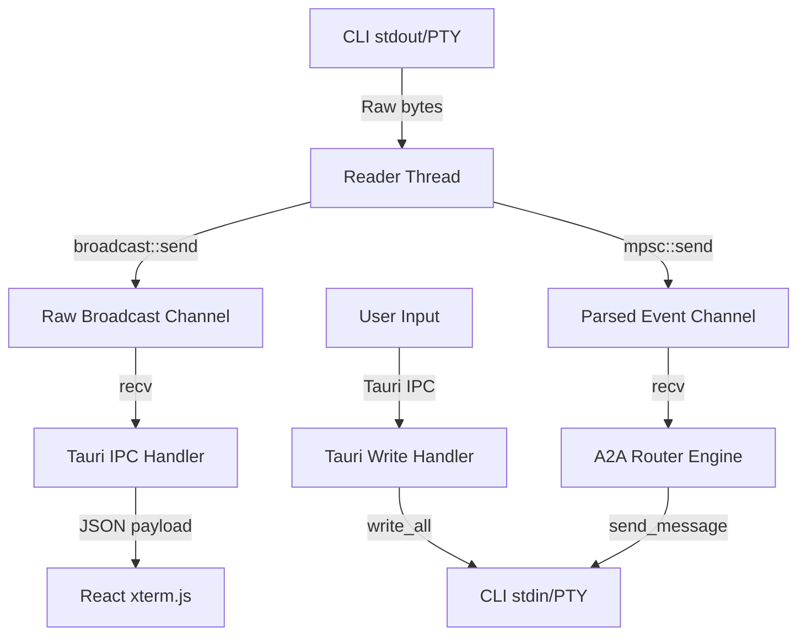

# Spec: Data Flow Architecture

## Related
- [[ADR-002]]
- [[T-033]]

## Scope
Defines the end-to-end data flow from agent CLI outputs (stdout) through the Rust backend, Tauri IPC, and into the React frontend. It details the backpressure policy and dual-subscriber model for raw bytes (UI) and parsed events (Router).

## Interfaces/schemas
The primary transport mechanism is `tokio::sync::broadcast` for raw bytes and `tokio::sync::mpsc` for parsed events.

## Data
Data flows from the PTY stdout as a byte stream.
The `pty_adapter.rs` intercepts this stream and splits it.
Raw bytes are broadcast to any subscriber (e.g., the UI terminal pane).
Simultaneously, the adapter parses the stream into `AgentEvent` objects and sends them to the Router.

## Security
- Threat 1: Malicious sequences in stdout. Mitigation: xterm.js sanitizes ANSI escapes, Router uses strict JSON parsing.
- Threat 2: Denial of Service via massive output (stdout flooding). Mitigation: Bounded broadcast channels drop lagging messages.
- Threat 3: Data leakage between sessions. Mitigation: Channels are strictly scoped per agent session ID.

## UI
The React frontend uses a `TerminalPane` component running `xterm.js`. It subscribes to the Tauri IPC channel matching its session ID to receive raw text output.

## Acceptance tests
- AT-1.1: Verify `broadcast::channel` successfully delivers the same bytes to multiple concurrent UI subscribers.
- AT-1.2: Verify a lagging UI subscriber receives a `RecvError::Lagged` error instead of blocking the reader thread.
- AT-1.3: Verify parsed events are delivered to the Router even if UI subscribers are lagging.

## Open questions
- Should we provide a binary stream IPC for the UI instead of JSON-encoded strings to improve performance on large outputs?
