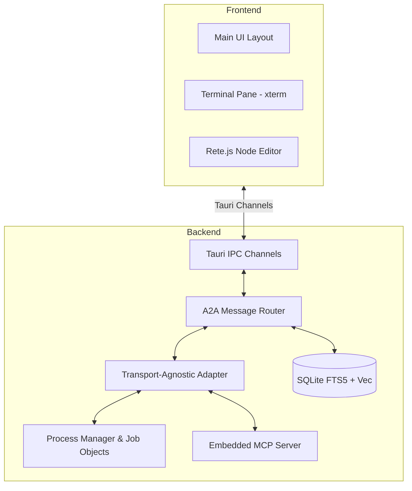

# Loom: Build Specification

## 1. Pinned Tech Stack
- **Backend:** Rust 1.80+, Tauri v2.11 (`tauri` and `tauri-build`).
- **Process/PTY:** `portable-pty` v0.8.1, `windows-sys` (Job Objects).
- **Frontend:** React 18.3 (TypeScript), Vite 5.4, TailwindCSS.
- **Terminal Rendering:** `@xterm/xterm` v5.4+.
- **Database:** `rusqlite` + FTS5 + `sqlite-vec` (v0.1.3).

## 2. Component Diagram


## 3. Module Boundaries & Interfaces

### Transport-Agnostic Adapter
```rust
pub struct AdapterCapabilities {
    pub supports_acp: bool,
    pub supports_headless_json: bool,
}

pub trait AgentAdapter {
    fn spawn(&self, cmd: &str, args: &[&str], env: &HashMap<String, String>, cwd: &Path) -> Result<ChildId, Error>;
    fn send_message(&self, msg: &AgentMessage) -> Result<(), Error>;
    fn poll_events(&self) -> Option<AgentEvent>;
    fn request_approval(&self, req: ApprovalRequest) -> Result<(), Error>;
    fn resume_from_approval(&self, res: ApprovalResponse) -> Result<(), Error>;
    fn cancel(&self) -> Result<(), Error>;
    fn extract_usage(&self) -> Option<UsageStats>;
    fn capabilities(&self) -> AdapterCapabilities;
}

pub enum Transport { HeadlessJson, Acp, Pty }
```

### A2A Message Router
Routes messages between agents, enforcing bounds.
```rust
pub struct MessageSchema {
    pub sender: String,
    pub recipient: String,
    pub content: String,
    pub token_cost_cents: u32,
}

pub struct MessageRouter {
    pub loop_guard: u32,
    pub max_turns: u32,
    pub budget_proxy_cents: u32,
}
```

### SQLite Schema Draft (FTS5 + Vec)
```sql
CREATE TABLE memory_nodes (
    id INTEGER PRIMARY KEY,
    title TEXT,
    content TEXT,
    path TEXT UNIQUE,
    provenance TEXT,
    staleness_timestamp DATETIME DEFAULT CURRENT_TIMESTAMP,
    embedding_model TEXT
);

CREATE VIRTUAL TABLE memory_fts USING fts5(
    title, content, content='memory_nodes', content_rowid='id'
);

-- FTS5 Sync Triggers
CREATE TRIGGER memory_nodes_ai AFTER INSERT ON memory_nodes BEGIN
  INSERT INTO memory_fts(rowid, title, content) VALUES (new.id, new.title, new.content);
END;
CREATE TRIGGER memory_nodes_ad AFTER DELETE ON memory_nodes BEGIN
  INSERT INTO memory_fts(memory_fts, rowid, title, content) VALUES('delete', old.id, old.title, old.content);
END;
CREATE TRIGGER memory_nodes_au AFTER UPDATE ON memory_nodes BEGIN
  INSERT INTO memory_fts(memory_fts, rowid, title, content) VALUES('delete', old.id, old.title, old.content);
  INSERT INTO memory_fts(rowid, title, content) VALUES (new.id, new.title, new.content);
END;

-- sqlite-vec extension
CREATE VIRTUAL TABLE vectors USING vec0(
    embedding float[384]
);

CREATE TABLE graph_edges (
    source_id INTEGER,
    target_id INTEGER,
    relationship TEXT,
    FOREIGN KEY(source_id) REFERENCES memory_nodes(id),
    FOREIGN KEY(target_id) REFERENCES memory_nodes(id)
);
```

## 4. Worktree Lifecycle & Arena Mode
1. **Init:** User triggers Arena Mode. Loom runs `git worktree add .loom-trees/arena-claude`.
2. **Execute:** Agents run.
3. **Compare-and-Merge:** The UI displays a side-by-side diff. The user can either "Pick One" (discarding the other worktree) or "Merge Both" (running a 3-way git merge resolving line-by-line).
4. **Cleanup:** `git merge`, then `git worktree remove --force`.

## 5. Security, Config & Data Layout
- **Extension Isolation:** 1) Deterministic MCP repo classification. 2) Prompt-injection scrub of READMEs. 3) Execution isolated via **Windows AppContainer**. 4) UI Permission Prompt for all high-risk tools.
- **Config & Repo Layout:** `~/.loom/config.toml` for global config. Workspace specific settings exist inside `.loom/`.
- **Data (Vault):** `.loom/vault/` (Markdown files for the semantic graph).
- **Approval Model:** All irreversible actions (NPM publish, large file deletes) emit an `ApprovalRequest` via the Adapter, suspending the agent until the user responds in the Right Pane.
- **Audit-Log Format:** `.loom/logs/audit.jsonl` (NDJSON format detailing timestamps, agent ID, tool executed, args, and cost in cents).

## 6. Release Pipeline
- **CI/CD:** GitHub Actions -> Matrix builds (Windows x86_64) -> Azure Artifact Signing (or fallback OV Cert) -> NSIS bundler.
- **Testing:** Unit tests (Rust), Fake-CLI mock binary, Tauri E2E (`tauri-driver` / WebDriver).

## 7. MVP Definition & Milestones
*Assumption: 1 dev, 20 hrs/week. (~220 Hours Total)*

**Milestone 1: Core Orchestrator (26 Hrs)**
- Tauri setup, xterm, PTY spawning, fast IPC channels. Job Object kill switch.
- *Test:* Launch Claude Code, interact, kill cleanly.

**Milestone 2: Agent Communication (50 Hrs)**
- HeadlessJSON adapter. ACP bridge. A2A Router with loop/budget guards.
- *Test:* Agent A output routed to Agent B. Router terminates loop at `max_turns=5`.

**Milestone 3: Arena Mode (34 Hrs)**
- Git worktree automation, SQLite memory, visual compare-and-merge.
- *Test:* Two agents attempt the same prompt in different worktrees without file conflicts.

**Milestone 4: Extensions & Tools (68 Hrs)**
- Deterministic MCP repo classification, AppContainer isolation, prompt-injection scrubbing. 
- Map `AGENTS.md` to `CLAUDE.md`. Built-in tools.

**Milestone 5: Pipeline & Distribution (42 Hrs)**
- CI matrix, Signing, NSIS, WebDriver E2E testing.

*Cut First if short on time:* Cut the entire Extension Installer (M4). Provide no extension support rather than unsandboxed code.
